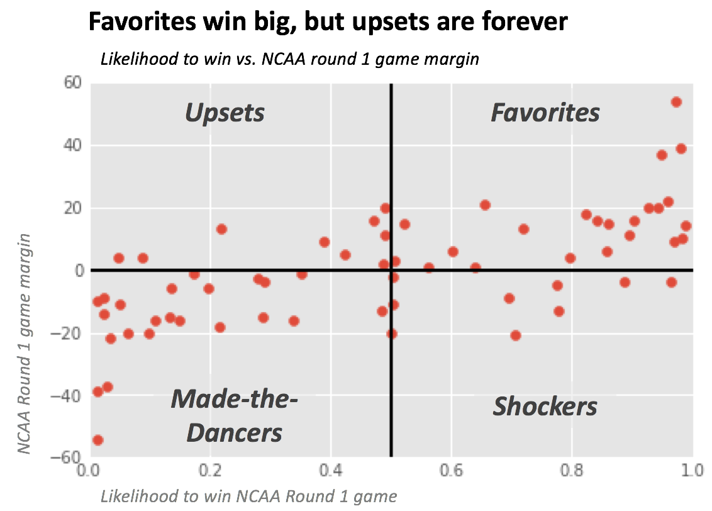

Ah, March.

It's a time of bright [spring sunshine](http://www.accuweather.com/en/weather-news/noreaster-shuts-down-travel-threatens-to-unleash-blizzard-conditions-in-at-least-8-states/70001093), cherry blossoms, and people everywhere searching their memories for where exactly [Xavier University](https://en.wikipedia.org/wiki/Xavier_University "Cincinnati") is.

It's tournament season! Or at least it is every year in my household until UNC loses. But beyond my general interest in watching a round ball go through a hoop, it's also a great time to test out predictions. Since everyone and their brother makes predictions about who is likely to win the games each round, I thought I'd check and see how they are doing.

To do that, I simulated the projections from data scientists at [CBS Sports](http://www.cbssports.com/college-basketball/bracketology/), [Yahoo!](https://sports.yahoo.com/m/66607537-5012-36a0-8694-65a0522cf6c1/ss_2017-ncaa-tournament-bracket.html), data [blog 538](https://projects.fivethirtyeight.com/2017-march-madness-predictions/), [ESPN](http://www.espn.com/mens-college-basketball/bracketology), college basketball stat-tracker [Ken Pomeroy](http://kenpom.com/), and sports handicapper [Jeff Sagarin](http://sagarin.com/sports/cbsend.htm).

I collected the percentage likelihoods for each of the rounds from where they were compiled at the [NY Times Upshot](https://www.nytimes.com/interactive/2017/03/13/upshot/ncaa-bracket-super-table.html). 

More methodology
I then created a simulator that used the projections given, and for each school, simulated 5,000 iterations of each team's probability. I compiled the results of these simulations into an overall projection that differs very slightly (and randomly) from the average of the range of probability projections from a school.

Since the first round of the tournament is 64 hours of basketball shoved into a two-day period, it's often the most exciting period, and the best for analyzing predictions. So I compiled the results of the first round and compared the scores for each team to the prior prediction.

As the graph below demonstrates, these results split out into four groups:
* **Favorites**: teams that are performing as advertised; they were supposed to win, and they did win
* **Upsets**: this is the reason we watch March Madness; these are the teams that weren't supposed to win, and then they do. The farther to the left they appear, the more surprising it was.
* **Shockers**: this is where the [crying](http://screengrabber.deadspin.com/piccolo-tears-are-the-saddest-tears-1692898303) happens; these teams were supposed to win, but lost. Brutal.
* **Made-the-Dancers**: where it was an honor just to be nominated, but nobody expected them to win, and they didn't.

As we move into the second weekend of the tournament, I'll keep taking a look at how these predictions held up. There are some early upsets. Last year's champ Villanova have already lost this year. I felt bad for them for exactly [4.7 seconds](https://www.youtube.com/watch?v=EMHoGRp1QrE).
