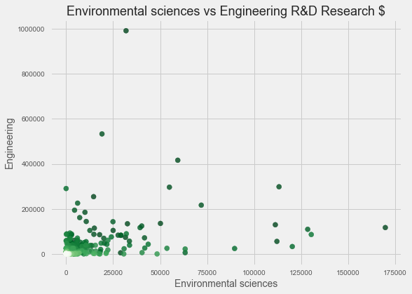
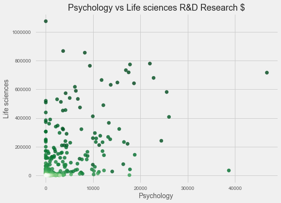
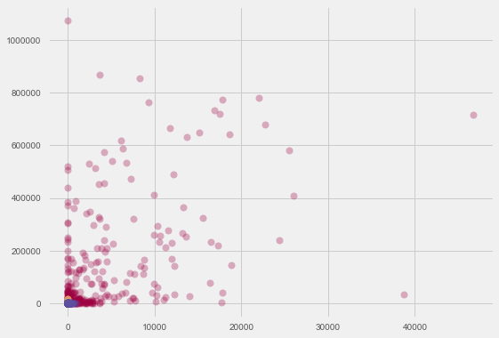
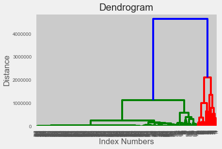
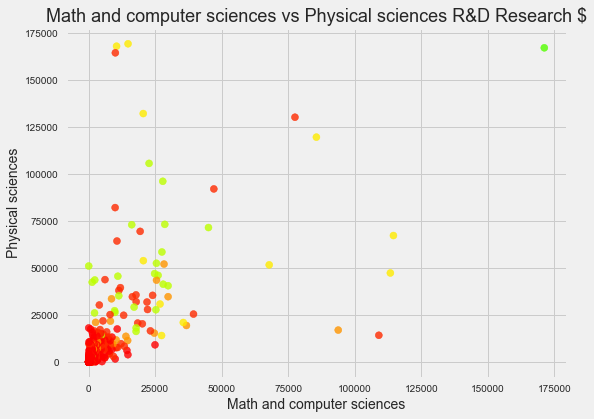

Institutions of higher education are constantly comparing themselves to one another, and one of the ways they do so is using their total amount of funding dollars.

But total amount of funding is, at best, a blunt instrument. The National Center for Science and Engineering Statistics (part of the National Science Foundation) releases an annual survey of these research dollars, and breaks them down [all sorts of ways](https://ncsesdata.nsf.gov/herd/2015/), including [by field](https://ncsesdata.nsf.gov/herd/2015/html/HERD2015_DST_18.html).
 

### Data

This table is a selection of the 640 universities that responded to the survey for 2015. *Rank* indicates the university's relative positioning to other institutions in terms of total research funding. Johns Hopkins has the most funding, and comes in with nearly twice as much as the next-highest institution (the University of Michigan - Ann Arbor).

The other variable names correspond with research funding received by various fields in 2015 (*measured in thousands of dollars*).

Rank |	Institution |	Environmental sciences |	Life sciences |	Math and computer sciences |	Physical sciences |	Psychology |	Social sciences |	Sciences, nec	| Engineering |	All non-S&E fields |
----------|
	1	| Johns Hopkins U.	| 31854|	867715	| 171205 |	167009 |	3663	| 11034	| 54640	| 991937	|6622
  2| U. Michigan, Ann Arbor|	14609	|779922|	25434|	52449|	21989|	149805|	1627|	254505|	68938
  24	| Georgia Institute of Technology|	19068|	19879|	113353|	47279|	7431|	9132|	7645|	533329|	8254
  28|	U. Southern California|	20051|	411987|	93765|	16924|	9935|	27941|	327|	69527|	40574
	32	| U. Illinois, Urbana-Champaign	|7214|	220029	|114512	|67182|	17276|	21340|	5000|	161458	|25806
	89|	Carnegie Mellon U.	|348|	11212|	109026	|14162|	7757|	6791	|3479|	89054|	175

 

### Initial Exploration

I wanted to look beyond these total figures and see how unsupervised machine learning would classify these schools compared to one another. I started by examining total research dollars for various sets of fields against one another. Scatter plots are a useful way to see that information. Here, darker points indicate greater total research dollars.

Most plots that are highly clustered around 0, with bands of institutions fanning out. In some cases, such as engineering, institutions with a greater concentration of students are outliers, but don't necessarily show a high degree of difference between them.

Psychology and Life Sciences, however, have a data distribution that allow us to see some of the spread of data, which makes them a decent place to start visualizing the way some of these schools might cluster together.
 

### Density clustering

These data points seem relatively tightly grouped, and I'll start with DBSCAN, a density-based clustering algorithm that accounts for noise as part of its algorithm. *For an exceptional visualization of DBSCAN, check out [Naftali Harris's blog](https://www.naftaliharris.com/blog/visualizing-dbscan-clustering/).*

I'll use the same plot of Psychology vs Life Sciences that looked promising before, but colorized by the clusters that DBSCAN assigns.

Yikes. This only shows 2-3 clusters, and they don't seem to be particularly useful in describing the data. It doesn't look particularly good, but eyeballing it isn't always a great way to determine the usefulness of unsupervised learning algorithms, so I'll check the numbers.

* **Estimated number of clusters:** 3, as we could *just* make out  
* **Homogeneity:** 0.114 
  - Ouch - our clusters heavily overlap with one another; the best score is 1
* **Completeness:** 1.000  
  - All the members of a given class are in the same cluster - this is to be expected since we have such unbalanced classes
* **V-measure:** 0.205  
  - The harmonic mean between homogeneity and completeness, higher is better
* **Silhouette Coefficient:** -0.074  
  - This score shows how distinct clusters are from one another. Scores near zero indicate overlapping clusters (*bad*) and negative scores indicate incorrect clustering (*worse*).

So on the whole, this doesn't seem like a very good algorithm to use. The data is too dense on the whole to create unique cluster values.
 

### Hierarchical clustering
To improve our approach, it would be useful to be able to see how many clusters we would have at various levels. Fortunately, there is a useful approach called hierarchical clustering that builds agglomerative groupings as data points are more similar to one another.

This results in a tree-type diagram that shows the "distance" (here measured in research dollars) between two data points.

On first inspection, there look to be a couple of good places to break up our clusters.
* If we want a very simple way to break down groups, we could still break it at ~$1.5 million, which would separate into three total groups, though one would include far more data points than the other. This is basically what the DBSCAN algorithm did.
* We could do it at around $1,000,000, which would break up the green data points into two groups, and would break up the red grouping into what appears to be four clusters.
* For more granularity, a break point at $500,000 appears to create around 10 clusters, though the distinction is hard to see with this diagram.

For the purposes of grouping schools together, I think that middle class of clusters is going to create the most useful separation, so I'll create clusters at the $1,000,000 mark.

And here is what the Psychology vs Life Sciences plot looks like, with different colors indicating cluster groupings.

Hey! It looks like there are distinct bands of colors in there! This looks like something we can use to better understand how universities are different. Let's look at one more.

Again, a useful banding, and one that is more prominent for the Life Sciences dimension than for the Environmental Sciences one.

Not all the comparisons will look as robust, but that's part of why the clustering itself is good - this can be difficult to eyeball.

 

### Final cluster insights

Below I have included a table of the final cluster groups. The big takeaway is that Johns Hopkins receives so much R&D funding that it stands alone as an institution. It is a cluster unto itself. It is the übercluster.

The next cluster includes a number of state universities, many of which fund a [significant portion of their operating budgets](../assets/UNCCH_budget.png "23% in 2012 at UNC-Chapel Hill") from federal grant money.

The next group of institutions includes a dozen largely technical institutions or large medical centers (as well as the University of California - Berkeley). Following that are smaller research-focused institutions, then larger institutions with less research focus, and finally a large group of primarily access-oriented institutions.

Here is a full list of the way these clusters break out.

|Cluster Size|Institutions|
|--------|
|1|Johns Hopkins U. |
|28| U. California, San Diego; U. Minnesota, Twin Cities; U. Wisconsin-Madison; Ohio State U.; Stanford U.; U. California, Los Angeles; Columbia U. in the City of New York; U. Michigan, Ann Arbor; U. North Carolina, Chapel Hill; U. Washington, Seattle; Cornell U.; Duke U.; U. Texas M. D. Anderson Cancer Center; U. Pennsylvania; Harvard U.; U. California, Davis; Yale U.; U. Florida; U. Pittsburgh, Pittsburgh; Washington U., Saint Louis; Northwestern U.; Emory U.; Vanderbilt U.; U. Alabama, Birmingham; U. California, San Francisco; Baylor C. of Medicine; Icahn School of Medicine at Mt. Sinai; U. Texas Southwestern Medical Center|
|12| U. Illinois, Urbana-Champaign; Georgia Institute of Technology; Massachusetts Institute of Technology; Pennsylvania State U., University Park and Hershey Medical Center; North Carolina State U.; Virginia Polytechnic Institute and State U.; Purdue U., West Lafayette; Texas A&M U., College Station and Health Science Center; Michigan State U.; U. California, Berkeley; U. Arizona; SUNY, Polytechnic Institute |
|28| U. Southern California; U. Utah; Indiana U., Bloomington; U. Chicago; Rutgers, State U. New Jersey, New Brunswick; New York U.; U. Illinois, Chicago; SUNY, U. Buffalo; U. Georgia; Rockefeller U.; U. South Florida, Tampa; Boston U.; U. Virginia, Charlottesville; U. Rochester; U. Kentucky; U. Iowa; U. Miami; U. Cincinnati; Case Western Reserve U.; U. Colorado Denver and Anschutz Medical Campus; U. Maryland, Baltimore; Scripps Research Institute; Uniformed Services U. of the Health Sciences; Oregon Health and Science U.; Yeshiva U.; U. Massachusetts, Medical School; Medical U. South Carolina; U. Texas Health Science Center, Houston|
|75| Carnegie Mellon U.; U. Texas, Austin; U. Maryland, College Park; Brown U.; U. Central Florida; U. Tennessee, Knoxville; U. Hawaii, Manoa; U. Massachusetts, Amherst; Arizona State U.; Princeton U.; Iowa State U.; SUNY, Stony Brook U.; U. California, Irvine; Rice U.; Florida International U.; U. Nebraska, Lincoln; Rensselaer Polytechnic Institute; U. Notre Dame; U. California, Santa Barbara; Mississippi State U.; Florida State U.; New Jersey Institute of Technology; California Institute of Technology; U. Colorado Boulder; Oregon State U.; Clemson U.; U. Houston; George Washington U.; SUNY, U. Albany; Texas Tech U.; Colorado State U., Fort Collins; U. Delaware; Washington State U.; Drexel U.; Kansas State U.; Tufts U.; U. New Mexico; Dartmouth C.; U. California, Riverside; Louisiana State U., Baton Rouge; U. Connecticut; Temple U.; North Dakota State U.; U. Missouri, Columbia; Oklahoma State U., Stillwater; Wayne State U.; U. California, Santa Cruz; U. South Carolina, Columbia; U. Kansas; Utah State U.; U. Idaho; Georgetown U.; U. Dayton; New Mexico State U.; Tulane U.; U. Oklahoma, Norman and Health Science Center; Virginia Commonwealth U.; West Virginia U.; U. Vermont; U. Louisville; U. Mississippi; Auburn U., Auburn; Wake Forest U.; U. Arkansas, Fayetteville; Woods Hole Oceanographic Institution; Medical C. Wisconsin; U. Texas Medical Branch; U. Texas Health Science Center, San Antonio; U. Nebraska, Medical Center; U. Arkansas for Medical Sciences; Thomas Jefferson U.; Cold Spring Harbor Laboratory; Rush U.; Georgia Regents U.; U. Tennessee, Health Science Center|
|496|U. Alabama, Huntsville; George Mason U.; U. Alabama, Tuscaloosa; Northeastern U.; U. Louisiana, Lafayette; U. Texas, Dallas; U. Maryland, Baltimore County; Naval Postgraduate School; Air Force Institute of Technology; SUNY, Binghamton U.; U. Texas, El Paso; San Diego State U.; U. Texas, Arlington; Worcester Polytechnic Institute; U. North Texas, Denton; U. North Carolina, Charlotte; DePaul U.; Wright State U.; Syracuse U.; U. Oregon; U. Texas, San Antonio; Rochester Institute of Technology; U. Massachusetts, Lowell; U.S. Air Force Academy; Louisiana Tech U.; Michigan Technological U.; Indiana U.-Purdue U., Indianapolis; U. Tulsa; U. Memphis; Brandeis U.; Georgia State U.; Boise State U.; Illinois Institute of Technology; U. Massachusetts, Boston; North Carolina Agricultural and Technical State U.; Brigham Young U., Provo; U. Nebraska, Omaha; Toyota Technological Institute, Chicago; Kent State U.; Stevens Institute of Technology; Texas State U.; California State U., San Bernardino; Portland State U.; C. of William and Mary and Virginia Institute of Marine Science; CUNY, City C.; Missouri U. of Science and Technology; Old Dominion U.; Jackson State U.; Southern Methodist U.; U. Nevada, Reno; U. Alaska, Fairbanks; San Francisco State U.; U. Wisconsin-Milwaukee; U. New Hampshire; U. Missouri, Kansas City; U. Wyoming; U.S. Naval Academy; Texas A&M U.-Corpus Christi; U. North Carolina, general administration; U. Arkansas, Little Rock; Harvey Mudd C.; U. California, Office of the President; U. Colorado Colorado Springs; Lehigh U.; U.S. Military Academy; U. New Orleans; American U.; Delaware State U.; Montana State U., Bozeman; Baylor U.; Villanova U.; Bryn Mawr C.; U. Massachusetts, Dartmouth; Alabama A&M U.; Northern Arizona U.; CUNY, Queens C.; Florida Institute of Technology; U. South Alabama; U. Nevada, Las Vegas; Gallaudet U.; Bowie State U.; Marquette U.; U. Tennessee, Chattanooga; California Polytechnic State U., San Luis Obispo; Boston C.; Tennessee Technological U.; Tuskegee U.; Desert Research Institute; Clarkson U.; Ball State U.; Florida Atlantic U.; Creighton U.; Rutgers, State U. New Jersey, Newark; U. Maine; Howard U.; U. Puerto Rico, Mayaguez; California State U., Northridge; Dakota State U.; Elizabeth City State U.; U. California, Merced; Southern Illinois U., Carbondale; Illinois State U.; Norfolk State U.; CUNY, system office; Smith C.; Western Washington U.; U. Puerto Rico, Rio Piedras; Williams C.; South Dakota State U.; Texas Southern U.; Western Michigan U. and Homer Stryker M.D. School of Medicine; Morgan State U.; U. Montana, Missoula; U. Akron; Hampton U.; Florida A&M U.; Miami U.; California State U., Bakersfield; U. South Dakota; U. Texas, Brownsville; Sam Houston State U.; C. Charleston; CUNY, Hunter C.; U. Texas Pan American; Oakland U.; Stephen F. Austin State U.; Loyola U., Chicago; Willamette U.; Northern Illinois U.; Wellesley C.; Fordham U.; Towson U.; U. Central Arkansas; U. Minnesota, Duluth; Calvin C.; California State U., San Marcos; U. Houston-Downtown; Tennessee State U.; Pennsylvania State U., Harrisburg; Pace U.; U. Rhode Island; Columbia U., Teachers C.; California State U., Monterey Bay; U. Southern Mississippi; U. Denver; Trinity C., Hartford; Colorado School of Mines; U. Metropolitana; Idaho State U.; U. Southern Maine; U. Northern Colorado; CUNY, John Jay C. of Criminal Justice; Montclair State U.; Prairie View A&M U.; Pomona C.; Carleton C.; Duquesne U.; California State U., Fresno; Vassar C.; Xavier U. Louisiana; St. Olaf C.; Cleveland State U.; U. Arkansas, Pine Bluff; Marist C.; San Jose State U.; CUNY, Brooklyn C.; California State U., Sacramento; U. North Carolina, Wilmington; Fayetteville State U.; New School; Fairfield U.; Mount Holyoke C.; Alcorn State U.; Wesleyan U.; Lewis and Clark C.; Rutgers, State U. New Jersey, Camden; U. North Carolina, Greensboro; Arkansas State U., Jonesboro; Saint Louis U.; U. North Florida; Central Connecticut State U.; Central Michigan U.; CUNY, C. Staten Island; Trinity U.; Embry-Riddle Aeronautical U.; Southern Illinois U., Edwardsville; U. Washington, Bothell; Southern U. and A&M C., Baton Rouge; Amherst C.; California State U., Channel Islands; U. North Dakota; Lafayette C.; Purdue U., Calumet; Loyola Marymount U.; Clark Atlanta U.; Spelman C.; CUNY, Graduate Center; Kean U.; Southern Connecticut State U.; Texas A&M International U.; New Mexico Institute of Mining and Technology; James Madison U.; Virginia State U.; U. Missouri, Saint Louis; Salisbury U.; Colgate U.; Ohio U.; West Chester U. Pennsylvania; U. Houston-Clear Lake; Texas A&M U.-Commerce; Appalachian State U.; U. Washington, Tacoma; Pennsylvania State U., Behrend; Georgia Southern U.; U. Hawaii, Hilo; East Tennessee State U.; CUNY, Lehman C.; Lamar U.; Reed C.; U. Wisconsin-Stevens Point; New York Institute of Technology; Bowdoin C.; Barnard C.; Claremont Graduate U.; Macalester C.; Bowling Green State U.; Seattle U.; Oberlin C.; U. Central Oklahoma; West Virginia State U.; Kennesaw State U.; Elon U.; U. South Carolina, Aiken; Wichita State U.; Azusa Pacific U.; Bates C.; SUNY, C. of Environmental Science and Forestry; West Texas A&M U.; Benedict C.; Morehouse C.; U. Detroit Mercy; Middle Tennessee State U.; Valparaiso U.; Grinnell C.; Swarthmore C.; Winthrop U.; Grand Valley State U.; C. of Saint Benedict; California State U., Dominguez Hills; Texas Christian U.; C. Wooster; U. West Florida; Bradley U.; Rowan U.; Norwich U.; U. Hartford; La Salle U.; U. del Turabo; Siena C.; Lincoln U., Jefferson City; Saint John's U., Collegeville; Bucknell U.; Shaw U.; Sonoma State U.; Indiana U.-Purdue U., Fort Wayne; U. Wisconsin-La Crosse; U. San Francisco; CUNY, Baruch C.; U. Wisconsin-Oshkosh; Kettering U.; California State U., Long Beach; Middlebury C.; U. South Carolina, Beaufort; Davidson C.; Minnesota State U., Mankato; Wiley C.; East Central U.; U. Baltimore; Ithaca C.; South Dakota School of Mines and Technology; Western Kentucky U.; South Carolina State U.; Lawrence Technological U.; Eastern Michigan U.; Union C., Schenectady; Saint Michael's C.; U. Nebraska, Kearney; U. Alaska, Anchorage; Colorado C.; U. West Georgia; Florida Gulf Coast U.; St. Cloud State U.; U. Toledo; Fort Valley State U.; St. John's U., Manhattan; Haverford C.; U. Wisconsin-Green Bay; Fisk U.; U. of the Pacific; U. Minnesota, Morris; Missouri State U.; Pepperdine U.; CUNY, Medgar Evers C.; Quinnipiac U.; Hamilton C.; East Carolina U.; Hofstra U.; U. Texas, Tyler; Furman U.; Colby C.; SUNY, Geneseo; Gonzaga U.; U. Wisconsin-Platteville; Hope C.; California State U., Chico; Claflin U.; CUNY, York C.; Suffolk U.; Kentucky State U.; California State U., Fullerton; Skidmore C.; Western Illinois U.; Murray State U.; Northern Kentucky U.; McNeese State U.; U. San Diego; Savannah State U.; Rider U.; California State Polytechnic U., Pomona; Indiana U., South Bend; U. Richmond; Eastern Connecticut State U.; U. of the District of Columbia; Marshall U.; U. Northern Iowa; Niagara U.; Nova Southeastern U.; Rhode Island School of Design; U. of Mary Washington; Chapman U.; U. Michigan, Dearborn; Roger Williams U.; Hawaii Pacific U.; Jacksonville State U.; Texas Woman's U.; Purdue U., North Central; Central State U.; Albany C. of Pharmacy and Health Sciences; Franklin and Marshall C.; Pacific U.; Washington and Lee U.; Saginaw Valley State U.; Western Carolina U.; Dickinson C.; Saint Joseph's U.; Coastal Carolina U.; Wheaton C., Wheaton; U. North Carolina, Asheville; Youngstown State U.; SUNY, C. Brockport; Sewanee: U. of the South; Santa Clara U.; Lake Superior State U.; U. Tennessee, Knoxville, Institute of Agriculture; U. Maryland, Center for Environmental Science; Louisiana State U., Health Sciences Center – New Orleans; U. North Texas, Health Science Center; U. Puerto Rico, Medical Sciences Campus; Eastern Virginia Medical School; Van Andel Institute; Texas Tech U., Health Sciences Center; Morehouse School of Medicine; Mercer U.; SUNY, Upstate Medical U.; SUNY, Downstate Medical Center; Loma Linda U.; Catholic U. of America; Louisiana State U., Health Sciences Center - Shreveport; Texas A&M U.-Kingsville; U. of the Virgin Islands; Texas Tech U., Health Sciences Center, El Paso; Albany Medical C.; New York Medical C.; Northeast Ohio Medical U.; Rosalind Franklin U. of Medicine and Science; Charles R. Drew U. of Medicine and Science; Meharry Medical C.; North Carolina Central U.; U. Texas Health Science Center, Tyler; Montana Tech of U. Montana; Humboldt State U.; Rhode Island C.; Tarleton State U.; U. Maryland, Eastern Shore; St. Edward's U.; Dillard U.; Midwestern U.; Langston U.; Ponce Health Sciences U.; U. New England; U. South Florida, Saint Petersburg; Seton Hall U.; Clark U.; U. Central del Caribe; U. Guam; National Defense U.; Alfred U.; U. Massachusetts, central office; California State U., Los Angeles; Western U. of Health Sciences; Southern U. and A&M C., Agricultural Research and Extension Center; A. T. Still U.; Milwaukee School of Engineering; U. Oklahoma, Tulsa; U. of the Sciences Philadelphia; MGH Institute of Health Professions; SUNY, C. of Optometry; Roseman U. of Health Sciences; Mills C.; Touro U., Vallejo; Memorial Sloan Kettering Cancer Center, Louis V. Gerstner Jr. Graduate S. of Biomedical Sciences; Fuller Theological Seminary; Eastern Washington U.; Plymouth State U.; Tougaloo C.; Southeastern Louisiana U.; Naval War C.; Central Washington U.; Philadelphia C. of Osteopathic Medicine; Northwest Indian C.; Black Hills State U.; Erikson Institute; SUNY, Buffalo State; National U.; Alabama State U.; Edward Via C. of Osteopathic Medicine; Pittsburg State U.; Sul Ross State U.; Commonwealth Medical C.; Franklin W. Olin C. of Engineering; Austin Peay State U.; U. Illinois, Springfield; Oregon Institute of Technology; Mercyhurst U.; Connecticut C.; Grambling State U.; Morehead State U.; U. New Haven; U. Texas, Permian Basin; Keck Graduate Institute; Wheeling Jesuit U.; Palmer C. of Chiropractic, Davenport; Eastern Kentucky U.; U. Louisiana, Monroe; Oklahoma State U., Center for Health Sciences; U. South Florida, Sarasota-Manatee; Nicholls State U.; U. Alaska, Southeast; Occidental C.; California Maritime Academy; Indiana State U.; U. Puerto Rico, Cayey; Maine Maritime Academy; Marshall B. Ketchum U.; Stockton U.; U. Tampa; Bastyr U.; Albany State U.; American Samoa Community C.; Providence C.; Emerson C.; Salus U.; Alaska Pacific U.; Christopher Newport U.; Augsburg C.; Salish Kootenai C.; U. del Este; La Sierra U.; SUNY, C. Plattsburgh; Heidelberg U.; SUNY, Farmingdale State C.; Seattle Pacific U.; California State U., Stanislaus; New England C. of Optometry; U. Western States; U. Houston system administration; Keene State C.; Hobart and William Smith Colleges; U. of the Incarnate Word; U. Puerto Rico, Humacao; Augustana C., Sioux Falls; Barry U.; CUNY, Advanced Science Research Center; U. Redlands; Doane C.; Florida Polytechnic U.|

 

*A detailed walkthrough of this analysis is available on my [github](https://github.com/austinbrian/DSI-labs/blob/master/Higher%20Ed%20R%26D%20Analysis.ipynb), with a more reader-friendly view on [NBViewer](http://nbviewer.jupyter.org/github/austinbrian/DSI-labs/blob/master/Higher%20Ed%20R%26D%20Analysis.ipynb).*
